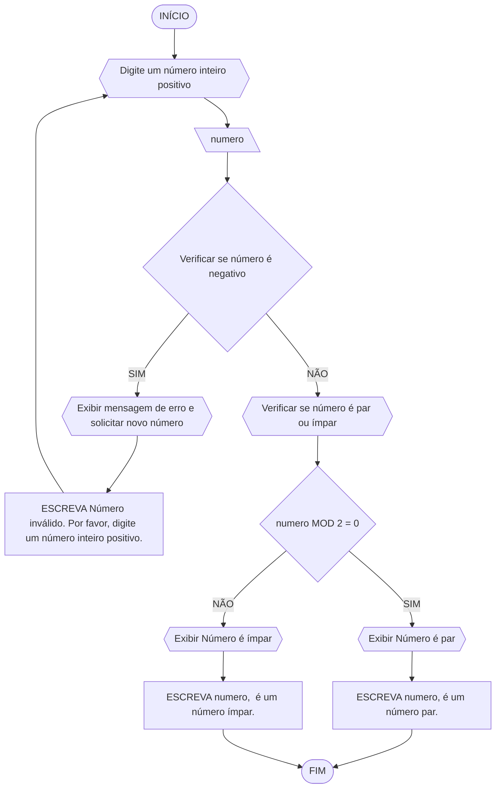
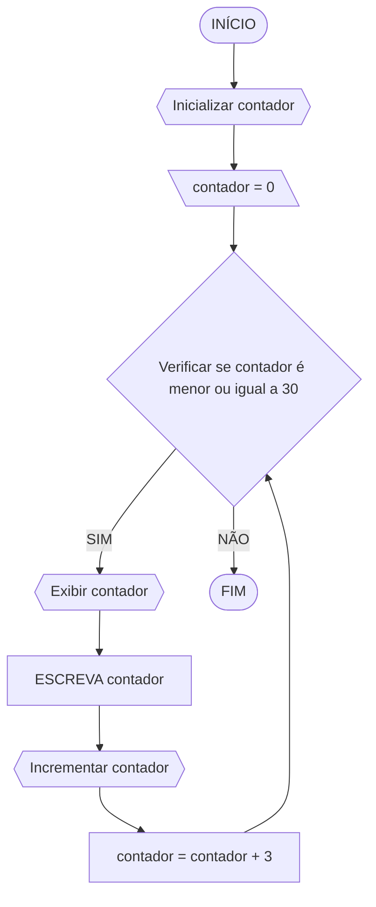

### Exercicio 1

### Pseudocodigo
```
1  ALGORITMO verificar_par_ou_impar
2  DECLARE numero: INTEIRO
3  INICIO
4    REPITA
5        ESCREVA "Digite um número inteiro positivo: "
6        LEIA numero
7        
8        SE numero < 0 ENTÃO
9            ESCREVA "Número inválido. Por favor, digite um número inteiro positivo."
10       FIM_SE
11   ATÉ que numero >= 0
12   
13   SE numero MOD 2 = 0 ENTÃO
14       ESCREVA numero, " é um número par."
15   SENÃO
16       ESCREVA numero, " é um número ímpar."
17   FIM_SE
18   
19   FIM
```
### Teste de mesa
Vamos criar uma tabela semelhante usando o pseudocódigo fornecido:

| número | número >= 0 | resto | resto == 0 | Saída |
| ------ | ----------- | ----- | ---------- | ------|
| -1     | F           |       |            | "Número inválido. Por favor, digite um número inteiro positivo." |
| 0      | V           | 0     | V          | "0 é um número par." |
| 13     | V           | 1     | F          | "13 é um número ímpar." |
| 30     | V           | 0     | V          | "30 é um número par." |

### Exercicio 2

### Fluxograma

### Pseudocodigo
```
1  ALGORITMO exibir_multiplos_de_3
2  DECLARE contador: INTEIRO
3  INICIO
4    PARA contador DE 0 ATÉ 30 PASSO 3 FAÇA
5        ESCREVA contador
6    FIM_PARA
7   
8    FIM

```
### Teste de mesa

| contador | contador é múltiplo de 3 | Saída |
| -------- | ------------------------ | ------|
| 0        | V                        | 0     |
| 3        | V                        | 3     |
| 6        | V                        | 6     |
| 9        | V                        | 9     |
| 12       | V                        | 12    |
| 15       | V                        | 15    |
| 18       | V                        | 18    |
| 21       | V                        | 21    |
| 24       | V                        | 24    |
| 27       | V                        | 27    |
| 30       | V                        | 30    |

