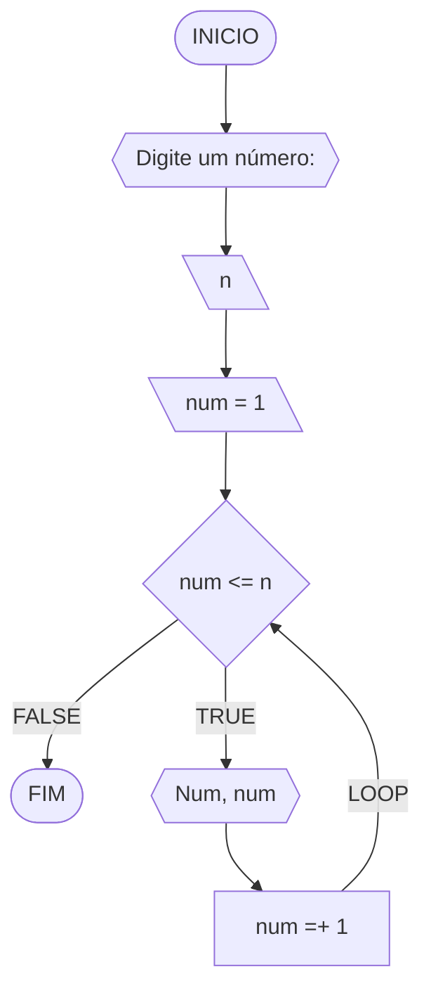

### Exercicio 1

#### Fluxograma


#### Pseudocódigo
```
1 ALGORITMO print_n_primeiros
2 DECLARE n, num: INTEIRO
3 INICIO
4 ESCREVA “Digite um número: ”
4 LEIA n			// variável de entrada n
4 num ← 1			// variável num inicializada
5 ENQUANTO num <= n FAÇA	// n iterações
7	ESCREVA “Número ”, num
8	num ← num + 1		// num =+ 1 (incremento)
8 FIM_ENQUANTO
9 FIM
```

#### Teste de mesa
| it | n  | num | num <= n | Saída      | num =+ 1 |
| -- | -- | --  | --       | --         | --       |
| 1  | 10 | 1   | True     | Número 1   | 2        |
| 2  | 10 | 2   | True     | Número 2   | 3        |
| 3  | 10 | 3   | True     | Número 3   | 4        |
| 4  | 10 | 4   | True     | Número 4   | 5        |
| 5  | 10 | 5   | True     | Número 5   | 6        |
| 6  | 10 | 6   | True     | Número 6   | 7        |
| 7  | 10 | 7   | True     | Número 7   | 8        |
| 8  | 10 | 8   | True     | Número 8   | 9        |
| 9  | 10 | 9   | True     | Número 9   | 10       |
| 10 | 10 | 11  | True     | Número 10  | 11       |
| 11 | 10 | 11  | False    |            |          |

