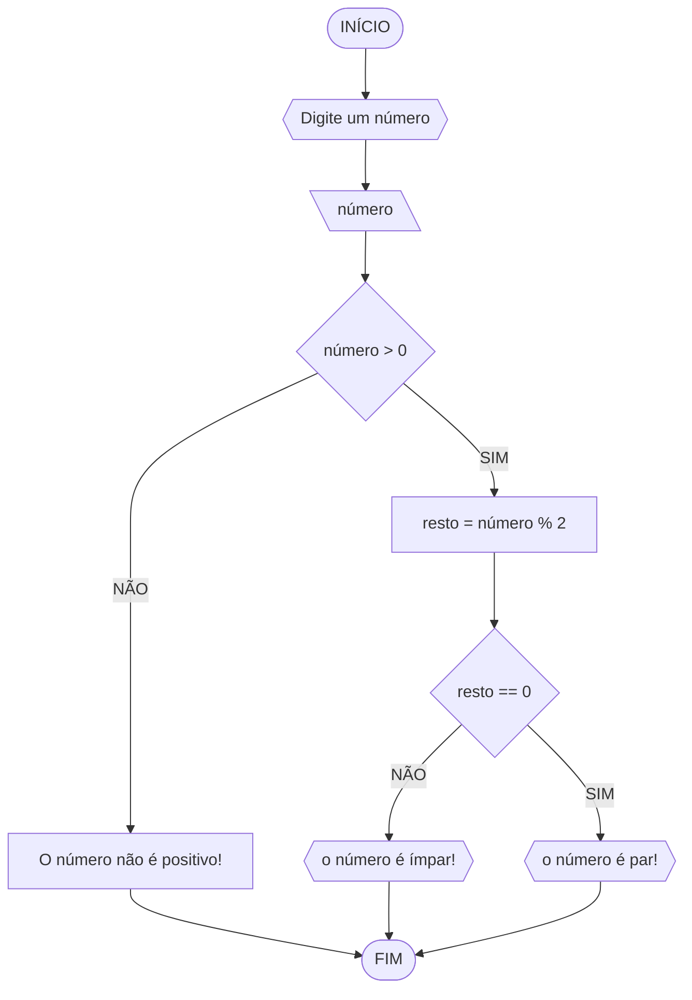

# UNIFOR

**Nome**: Nome do estudante
**Disciplina**: Raciocínio Lógico Algorítmico

## Exercício 3
### Fluxograma

```mermaid
flowchart TD
A([INÍCIO]) --> B{{Digite um número}}
B --> C[\número\]
C --> D{número > 0}
D --NÃO--> E[O número não é positivo!]
D --SIM--> F[resto = número % 2]
E --> Z([FIM])
F --> G{resto == 0}
G --NÃO--> H{{o número é ímpar!}}
G --SIM--> I{{o número é par!}}
H --> Z
I --> Z
```
