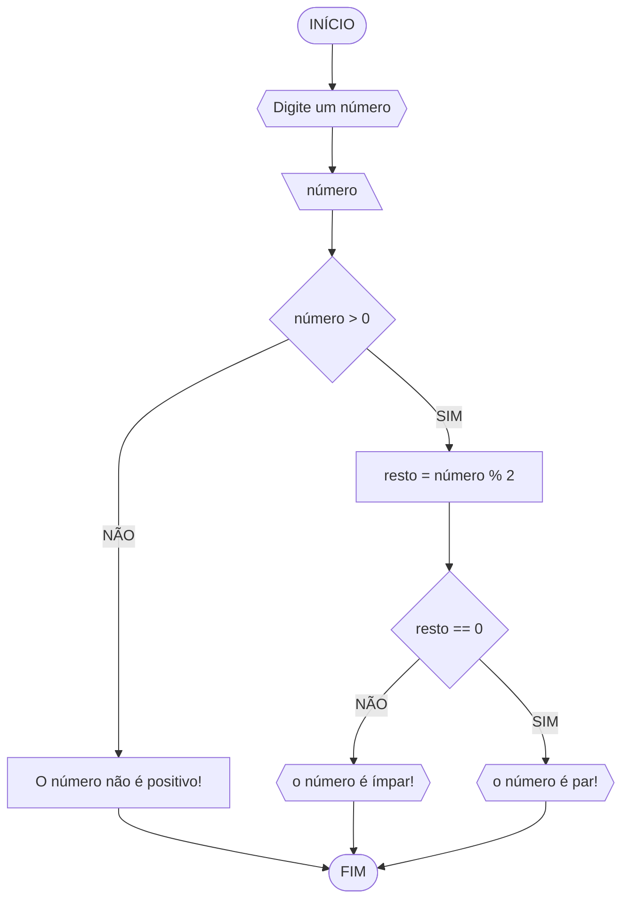
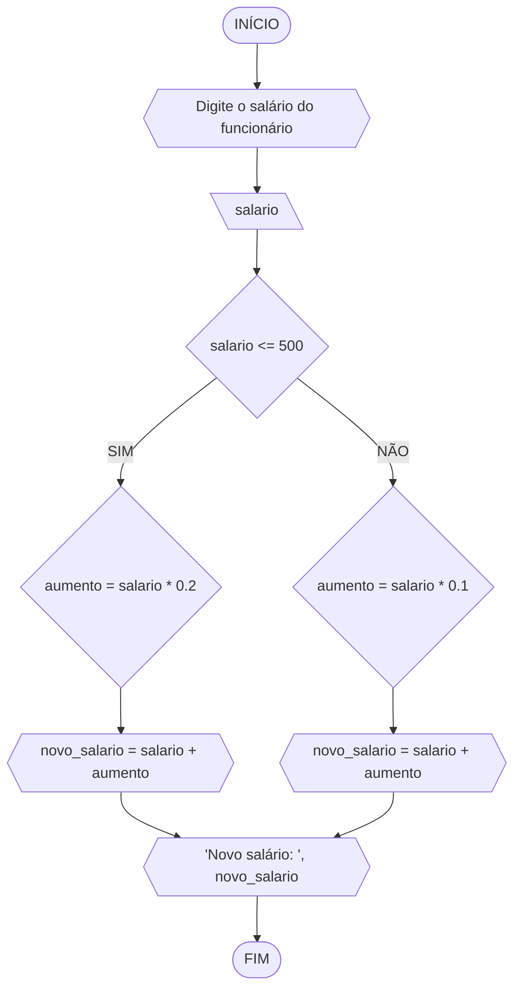

# UNIFOR

**Nome**: Nome do estudante
**Disciplina**: Raciocínio Lógico Algorítmico

## Lista 1 Exercício 1
### Fluxograma


### Pseudocódigo
```
1  ALGORÍTIMO verificapar_ímpar
2  DECLARE número, resto NUMÉRICO
3  ESCREVA "Digite um número: "
4  LEIA número
5  SE número > 0 ENTÃO
6    resto = número % 2
7    SE resto == 0 ENTÂO
8      ESCREVA "0 número é par!"
9    SENÃO
10     ESCREVA "O número é ímpar!"
11 SENÃO
12  ESCREVA "O número não positivo!"
13 FIM_ALGORITMO
```
#### Teste de mesa
| numero | numero >= 0 | resto | resto == 0 | Saída |
| -- | -- | -- | -- | -- | 
| -1 | F |   |   | "O número deve ser postivo!" |
| 0  | V | 0 | V | "O número é par!" |
| 13 | V | 1 | F | "O número é impar!" |
| 30 | V | 0 | V | "O número é par!" |

### Exercicio 2

### Fluxograma

### Pseudocodigo
```
ALGORITMO calcular_novo_salario
    DECLARE salario, aumento, novo_salario: REAL

    ESCREVA "Digite o salário do funcionário: "
    LEIA salario

    SE salario <= 500 ENTAO
        aumento = salario * 0.2
    SENAO
        aumento = salario * 0.1
    FIM_SE

    novo_salario = salario + aumento

    ESCREVA "Novo salário: ", novo_salario
FIM_ALGORITMO
```
### Teste de mesa
```
| Etapa | Descrição                                        | Dados/Resultado |
|-------|--------------------------------------------------|------------------|
| Início|                                                |                  |
| Passo 1| Digite o salário do funcionário:               | salario =        |
| Passo 2| Verificar se salario <= 500                     |                  |
|        |   - Verdadeiro:                                |                  |
|        |     - aumento = salario * 0.2                  |                  |
| Passo 3| Calcular novo salário:                         |                  |
|        |     - novo_salario = salario + aumento         |                  |
| Passo 4| Imprimir novo salário:                         | novo_salario     |
| Passo 5| Fim                                            |                  |

